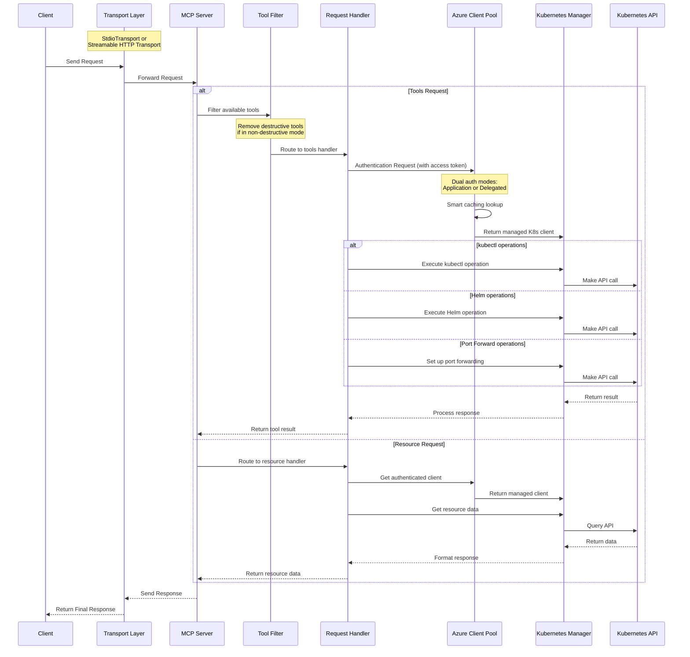

# MCP Server Azure Kubernetes

[](https://github.com/jhzhu89/mcp-server-azure-kubernetes/actions/workflows/ci.yml)
[](https://github.com/jhzhu89/mcp-server-azure-kubernetes)
[](https://bun.sh)
[](https://kubernetes.io/)
[](https://azure.microsoft.com/)
[](https://www.docker.com/)
[](https://github.com/jhzhu89/mcp-server-azure-kubernetes/stargazers)
[](https://github.com/jhzhu89/mcp-server-azure-kubernetes/issues)
[](https://github.com/jhzhu89/mcp-server-azure-kubernetes/pulls)
[](https://github.com/jhzhu89/mcp-server-azure-kubernetes/commits/main)
[](https://smithery.ai/protocol/mcp-server-azure-kubernetes)

MCP Server that connects to Azure Kubernetes Service (AKS) clusters with intelligent Azure AD authentication and caching. Powered by [`@jhzhu89/azure-client-pool`](https://github.com/jhzhu89/azure-client-pool) for multi-tenant access.

> **Note**: This project is forked from [Flux159/mcp-server-kubernetes](https://github.com/Flux159/mcp-server-kubernetes) and enhanced for Azure scenarios.

## Usage

### Authentication Modes

This server supports **dual authentication modes** powered by `@jhzhu89/azure-client-pool`:

#### 🔧 **Application Mode** (Development)

- **Best for**: Local development, single-user scenarios
- **Authentication**: Uses Azure CLI credentials (`az login`)
- **Setup**: Minimal configuration required
- **Caching**: Simple global client cache

#### 🏢 **Delegated Mode** (Production)

- **Best for**: Multi-user web applications, production environments
- **Authentication**: Azure AD On-Behalf-Of (OBO) flow with user JWT tokens
- **Setup**: Requires Azure AD application with client secret/certificate
- **Caching**: Per-user, per-tenant intelligent caching with automatic lifecycle management

### Access Token Requirements

When using **Delegated Mode**, clients must provide a valid Azure AD access token:

#### Prerequisites

1. **Azure AD Application Registration** with API permissions:

   - `https://management.azure.com/user_impersonation` (ARM API access)
   - `6dae42f8-4368-4678-94ff-3960e28e3630/user.read` (AKS dataplane access)

2. **Client Access Token**: Obtained with the server's Azure AD application as audience

#### Token Transmission

Clients send tokens via HTTP header or tool argument:

- **HTTP Header**: `Authorization: Bearer <access_token>`
- **Tool Argument**: Include `access_token` parameter in tool calls

#### Example Tool Call with Access Token

```json
{
  "name": "list_pods",
  "arguments": {
    "namespace": "default",
    "subscriptionId": "your-subscription-id",
    "resourceGroup": "your-resource-group",
    "clusterName": "your-aks-cluster",
    "access_token": "eyJ0eXAiOiJKV1QiLCJhbGciOiJSUzI1NiIs..."
  }
}
```

#### Security Best Practices for Access Tokens

**⚠️ Important**: Passing `access_token` via tool arguments is a workaround due to current limitations in Python MCP clients that prevent proper HTTP header transmission of user access tokens.

**Recommended Implementation**:

- Use **function call filters** to inject `access_token` programmatically (Semantic Kernel approach - other frameworks may require different methods)
- **Never** include `access_token` in tool schemas visible to AI models
- **Never** allow AI models to handle or generate access tokens

**Server-side handling**:

- Extract `access_token` from arguments in the server implementation
- **Do not** declare `access_token` in the tool's input schema
- Process the token for authentication but keep it hidden from the AI model

**Example with Semantic Kernel**:

```csharp
public async Task OnFunctionInvocationAsync(FunctionInvocationContext context)
{
    // Inject user's access token (hidden from AI model)
    context.Arguments["access_token"] = userAccessToken;
    await next(context);
}
```

This approach ensures that:

- Access tokens are never exposed to the AI model
- Tokens are injected by the application layer, not the AI
- The MCP server can still receive and use the tokens for authentication

#### Intelligent Caching & Client Management

The server automatically manages:

- **Per-user client caching** with tenant isolation
- **Token lifecycle management** with automatic refresh
- **Multi-cluster support** - separate cached clients per AKS cluster
- **Resource cleanup** with automatic disposal when cached clients expire

### When to Use Which Mode?

| Scenario            | Application Mode                | Delegated Mode                |
| ------------------- | ------------------------------- | ----------------------------- |
| Local development   | ✅ Simple setup with `az login` | ❌ Requires additional config |
| Single-user tools   | ✅ Direct Azure CLI integration | ❌ Unnecessary complexity     |
| Multi-user web apps | ❌ No user context              | ✅ Proper user delegation     |
| Production APIs     | ❌ Requires Azure CLI on server | ✅ Standard OAuth2 flow       |
| Multi-tenant SaaS   | ❌ Limited to CLI user          | ✅ Full multi-tenant support  |

## Usage with mcp-chat

[mcp-chat](https://github.com/jhzhu89/mcp-chat) is a CLI chat client for MCP servers. You can use it to interact with the Azure Kubernetes server.

```shell
npx mcp-chat --server "npx mcp-server-azure-kubernetes"
```

## Features

- [x] **Dual Authentication Modes**: Application mode (development) and Delegated mode (production)
- [x] **Intelligent Client Caching**: Per-user, per-tenant, per-cluster caching with automatic lifecycle management
- [x] **Multi-tenant Support**: Secure tenant isolation and dynamic AKS cluster access
- [x] **Unified kubectl API** for managing resources:
  - Get or list resources with `kubectl_get`
  - Describe resources with `kubectl_describe`
  - List resources with `kubectl_list`
  - Create resources with `kubectl_create`
  - Apply YAML manifests with `kubectl_apply`
  - Delete resources with `kubectl_delete`
  - Get logs with `kubectl_logs`
  - Manage kubectl contexts with `kubectl_context`
  - Explain Kubernetes resources with `explain_resource`
  - List API resources with `list_api_resources`
  - Scale resources with `kubectl_scale`
  - Update field(s) of a resource with `kubectl_patch`
  - Manage deployment rollouts with `kubectl_rollout`
  - Execute any kubectl command with `kubectl_generic`
- [x] **Advanced operations**
  - Scale deployments with `kubectl_scale`
  - Port forward to pods and services with `port_forward`
  - **Helm operations**: Install, upgrade, and uninstall charts with custom values and repositories
- [x] **Azure-specific capabilities**
  - Automatic ARM and AKS dataplane token management
  - Smart client fingerprinting for efficient resource reuse
  - Token caching with TTL and size limits
- [x] **Non-destructive mode** for read and create/update-only access to clusters

## Local Development

Make sure that you have [bun installed](https://bun.sh/docs/installation). Clone the repo & install dependencies:

```bash
git clone https://github.com/jhzhu89/mcp-server-azure-kubernetes.git
cd mcp-server-azure-kubernetes
bun install
```

### Development Workflow

1. Start the server in development mode (watches for file changes):

```bash
bun run dev
```

2. Run unit tests:

```bash
bun run test
```

3. Build the project:

```bash
bun run build
```

4. Local Testing with [Inspector](https://github.com/modelcontextprotocol/inspector)

```bash
npx @modelcontextprotocol/inspector node dist/index.js
# Follow further instructions on terminal for Inspector link
```

## Contributing

See the [CONTRIBUTING.md](CONTRIBUTING.md) file for details.

## Advanced

### Non-Destructive Mode

You can run the server in a non-destructive mode that disables all destructive operations (delete pods, delete deployments, delete namespaces, etc.):

```shell
ALLOW_ONLY_NON_DESTRUCTIVE_TOOLS=true npx mcp-server-azure-kubernetes
```

### Commands Available in Non-Destructive Mode

All read-only and resource creation/update operations remain available:

- Resource Information: `kubectl_get`, `kubectl_describe`, `kubectl_list`, `kubectl_logs`, `explain_resource`, `list_api_resources`
- Resource Creation/Modification: `kubectl_apply`, `kubectl_create`, `kubectl_scale`, `kubectl_patch`, `kubectl_rollout`
- Helm Operations: `install_helm_chart`, `upgrade_helm_chart`
- Connectivity: `port_forward`, `stop_port_forward`
- Context Management: `kubectl_context`

### Commands Disabled in Non-Destructive Mode

The following destructive operations are disabled:

- `kubectl_delete`: Deleting any Kubernetes resources
- `uninstall_helm_chart`: Uninstalling Helm charts
- `cleanup`: Cleanup of managed resources
- `kubectl_generic`: General kubectl command access (may include destructive operations)

For additional advanced features, see the [ADVANCED_README.md](ADVANCED_README.md).

## Architecture

This server leverages [`@jhzhu89/azure-client-pool`](https://github.com/jhzhu89/azure-client-pool) for Azure authentication and client management.

### Request Flow

The sequence diagram below illustrates how requests flow through the system:



### Authentication & Caching Architecture

- **Application Mode**: Uses Azure CLI credentials with simple global caching
- **Delegated Mode**: Implements On-Behalf-Of flow with per-user, per-tenant caching
- **Smart Caching**: Clients cached by user identity, tenant, and AKS cluster configuration
- **Automatic Cleanup**: Cached clients automatically disposed when TTL expires
- **Resource Isolation**: Strong tenant boundaries with separate cache namespaces

## Publishing New Release

This project uses automated releases. Create a new release on the [releases page](https://github.com/jhzhu89/mcp-server-azure-kubernetes/releases) using semantic versioning (v{major}.{minor}.{patch}). The CI/CD pipeline will automatically build and publish to [npm](https://www.npmjs.com/package/mcp-server-azure-kubernetes).

## Not planned

Adding clusters to kubectx.

## Configuration

### Application Mode (Development)

Minimal setup using Azure CLI credentials:

```bash
# Login with Azure CLI
az login

# Set authentication mode (optional, defaults to 'application')
export AZURE_AUTH_MODE=application
export AZURE_CLIENT_ID=your-client-id
export AZURE_TENANT_ID=your-tenant-id

# Run the server
npx mcp-server-azure-kubernetes
```

### Delegated Mode (Production)

For multi-user production scenarios:

```bash
export AZURE_AUTH_MODE=delegated
export AZURE_CLIENT_ID=your-client-id
export AZURE_TENANT_ID=your-tenant-id
export AZURE_CLIENT_SECRET=your-client-secret
# OR use certificate-based authentication
export AZURE_CLIENT_CERTIFICATE_PATH=/path/to/cert.pem
```

### Azure AD Application Setup

#### 1. Register Application

```bash
az ad app create --display-name "MCP Server Azure Kubernetes" \
  --required-resource-accesses '[
    {
      "resourceAppId": "https://management.azure.com/",
      "resourceAccess": [
        {
          "id": "user_impersonation",
          "type": "Scope"
        }
      ]
    },
    {
      "resourceAppId": "6dae42f8-4368-4678-94ff-3960e28e3630",
      "resourceAccess": [
        {
          "id": "user.read",
          "type": "Scope"
        }
      ]
    }
  ]'
```

#### 2. Create Client Secret

```bash
az ad app credential reset --id <app-id> --display-name "MCP Server Secret"
```

#### 3. Configure Client Application

```javascript
// Example using MSAL.js
const tokenRequest = {
  scopes: [`api://${serverAppId}/.default`],
};
```

## What's Different in This Fork

This fork enhances the original MCP Server Kubernetes with **Azure capabilities** powered by `@jhzhu89/azure-client-pool`:

### Key Enhancements:

#### **🔐 Advanced Authentication**

- **Original**: Single kubeconfig-based authentication
- **This Fork**: Dual-mode authentication (Application + Delegated) with Azure AD integration

#### **🏢 Multi-tenancy**

- **Original**: Single-cluster, single-user access
- **This Fork**: Dynamic multi-cluster access with per-user tenant isolation

#### **⚡ Intelligent Client Management**

- **Original**: Static connection to pre-configured cluster
- **This Fork**: Smart caching with automatic client lifecycle management

#### **🎯 Zero Configuration**

- **Original**: Requires kubeconfig setup and cluster pre-configuration
- **This Fork**: Runtime cluster discovery based on user Azure AD permissions

### Use Cases:

- **🏢 Multi-Customer SaaS**: Each customer accesses only their AKS clusters
- **🏛️ Business Divisions**: Separate business units with isolated Azure tenants
- **🔧 Managed Service Providers**: Managing multiple customer environments
- **👥 Development Teams**: Separate dev/staging/prod environments across subscriptions

### Powered by Azure Client Pool

This fork leverages [`@jhzhu89/azure-client-pool`](https://github.com/jhzhu89/azure-client-pool) for:

- **Smart Caching**: Efficient client reuse with fingerprinting
- **Token Management**: Automatic Azure AD token lifecycle handling
- **Request Deduplication**: Prevents concurrent token requests
- **Resource Cleanup**: Automatic disposal of cached resources
