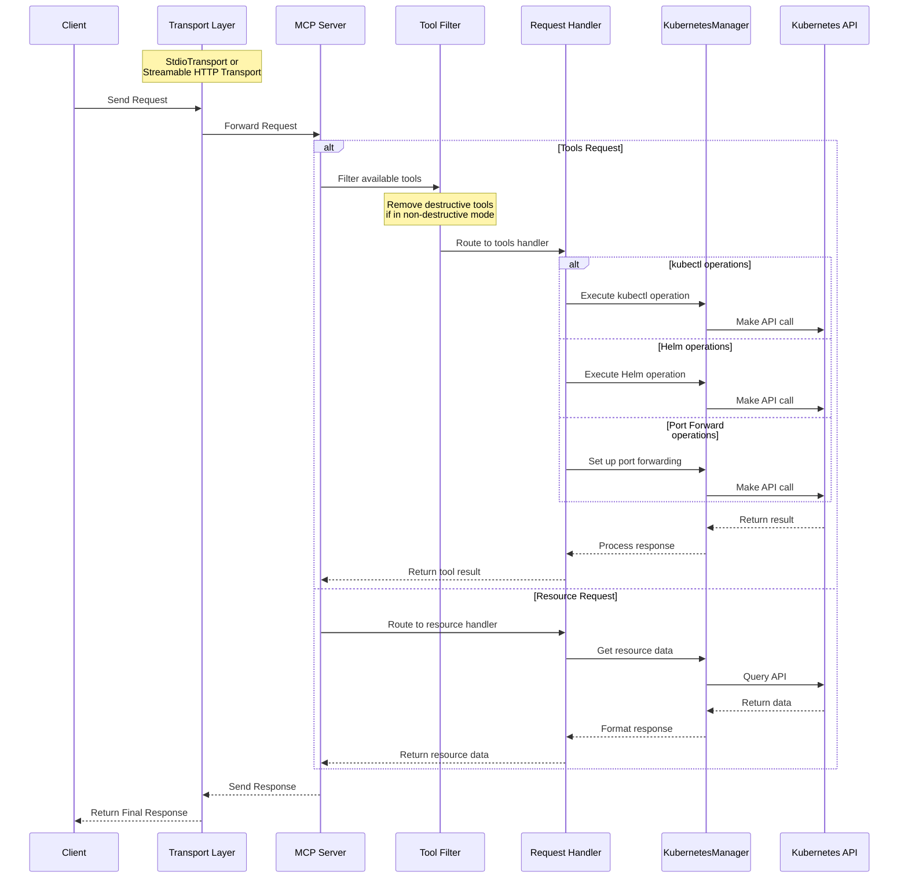

# MCP Server Azure Kubernetes

[](https://github.com/jhzhu89/mcp-server-azure-kubernetes/actions/workflows/ci.yml)
[](https://github.com/jhzhu89/mcp-server-azure-kubernetes)
[](https://bun.sh)
[](https://kubernetes.io/)
[](https://azure.microsoft.com/)
[](https://www.docker.com/)
[](https://github.com/jhzhu89/mcp-server-azure-kubernetes/stargazers)
[](https://github.com/jhzhu89/mcp-server-azure-kubernetes/issues)
[](https://github.com/jhzhu89/mcp-server-azure-kubernetes/pulls)
[](https://github.com/jhzhu89/mcp-server-azure-kubernetes/commits/main)
[](https://smithery.ai/protocol/mcp-server-azure-kubernetes)

MCP Server that can connect to Azure Kubernetes Service (AKS) clusters and manage them with Azure AD authentication. Supports Azure On-Behalf-Of (OBO) flow for secure multi-tenant access.

> **Note**: This project is forked from [Flux159/mcp-server-kubernetes](https://github.com/Flux159/mcp-server-kubernetes) and has been customized for Azure-specific multi-tenant scenarios.

## Usage

### Azure Authentication Setup

This server uses Azure AD authentication with On-Behalf-Of (OBO) flow for secure multi-tenant access to AKS clusters. The client must provide a valid Azure AD access token that has the configured Azure AD application as its audience.

#### Prerequisites

1. **Azure AD Application Registration**: The server must be configured with an Azure AD application that has the following API permissions:
   - `https://management.azure.com/user_impersonation` (ARM API access)
   - `6dae42f8-4368-4678-94ff-3960e28e3630/user.read` (AKS dataplane access)

2. **Client Access Token**: Clients must obtain an Azure AD access token with the server's Azure AD application as the audience.

#### Authentication Flow

1. **Client Token**: The client obtains an Azure AD access token with your server's Azure AD application as the audience
2. **Token Transmission**: The client sends this token via HTTP header or tool call argument:
   - HTTP Header: `Authorization: Bearer <access_token>`
   - Tool Argument: Include `access_token` parameter in tool calls
3. **OBO Flow**: The server performs On-Behalf-Of flow to exchange the client token for:
   - ARM API access token (for managing AKS clusters)
   - AKS dataplane access token (for kubectl operations)
4. **AKS Access**: The server uses these exchanged tokens to perform operations on behalf of the user

#### Example Tool Call with Access Token

When calling tools, include the access token:

```json
{
  "name": "list_pods",
  "arguments": {
    "namespace": "default",
    "access_token": "eyJ0eXAiOiJKV1QiLCJhbGciOiJSUzI1NiIs..."
  }
}
```

#### Important Security Note for Access Token Transmission

**Passing access_token via tool arguments is a workaround** due to current limitations in Python MCP clients that prevent proper HTTP header transmission of user access tokens.

**Recommended Implementation Pattern:**

When using frameworks like Semantic Kernel:

- Use **function call filters** to inject `access_token` into tool arguments
- **Never** include `access_token` in the tool's input schema
- **Never** allow the AI model to handle or generate access tokens
- The filter should intercept calls and add the token programmatically

Example with Semantic Kernel:

```csharp
// In your function call filter
public async Task OnFunctionInvocationAsync(FunctionInvocationContext context)
{
    // Add user's access token to arguments (not visible to AI model)
    context.Arguments["access_token"] = userAccessToken;

    // Continue with the function call
    await next(context);
}
```

**Server-side handling:**

- Extract `access_token` from arguments in the server implementation
- **Do not** declare `access_token` in the tool's input schema
- Process the token for authentication but keep it hidden from the AI model

This approach ensures that:

- Access tokens are never exposed to the AI model
- Tokens are injected by the application layer, not the AI
- The MCP server can still receive and use the tokens for authentication

#### Security Considerations

- The client access token must have the server's Azure AD application as its audience
- The server validates the token and extracts user context (tenant ID, user object ID)
- All operations are performed on behalf of the authenticated user
- The server maintains token caching for performance while respecting security boundaries

## Usage with mcp-chat

[mcp-chat](https://github.com/jhzhu89/mcp-chat) is a CLI chat client for MCP servers. You can use it to interact with the Azure Kubernetes server.

```shell
npx mcp-chat --server "npx mcp-server-azure-kubernetes"
```

## Features

- [x] Connect to Azure Kubernetes Service (AKS) clusters with Azure AD authentication
- [x] Azure On-Behalf-Of (OBO) flow for secure multi-tenant access
- [x] Unified kubectl API for managing resources
  - Get or list resources with `kubectl_get`
  - Describe resources with `kubectl_describe`
  - List resources with `kubectl_list`
  - Create resources with `kubectl_create`
  - Apply YAML manifests with `kubectl_apply`
  - Delete resources with `kubectl_delete`
  - Get logs with `kubectl_logs`
  - Manage kubectl contexts with `kubectl_context`
  - Explain Kubernetes resources with `explain_resource`
  - List API resources with `list_api_resources`
  - Scale resources with `kubectl_scale`
  - Update field(s) of a resource with `kubectl_patch`
  - Manage deployment rollouts with `kubectl_rollout`
  - Execute any kubectl command with `kubectl_generic`
- [x] Advanced operations
  - Scale deployments with `kubectl_scale` (replaces legacy `scale_deployment`)
  - Port forward to pods and services with `port_forward`
  - Run Helm operations
    - Install, upgrade, and uninstall charts
    - Support for custom values, repositories, and versions
- [x] Azure-specific features
  - Multi-tenant token management with caching
  - Tenant boundary validation
  - ARM and AKS dataplane token acquisition
- [x] Non-destructive mode for read and create/update-only access to clusters

## Local Development

Make sure that you have [bun installed](https://bun.sh/docs/installation). Clone the repo & install dependencies:

```bash
git clone https://github.com/jhzhu89/mcp-server-azure-kubernetes.git
cd mcp-server-azure-kubernetes
bun install
```

### Development Workflow

1. Start the server in development mode (watches for file changes):

```bash
bun run dev
```

2. Run unit tests:

```bash
bun run test
```

3. Build the project:

```bash
bun run build
```

4. Local Testing with [Inspector](https://github.com/modelcontextprotocol/inspector)

```bash
npx @modelcontextprotocol/inspector node dist/index.js
# Follow further instructions on terminal for Inspector link
```

## Contributing

See the [CONTRIBUTING.md](CONTRIBUTING.md) file for details.

## Advanced

### Non-Destructive Mode

You can run the server in a non-destructive mode that disables all destructive operations (delete pods, delete deployments, delete namespaces, etc.):

```shell
ALLOW_ONLY_NON_DESTRUCTIVE_TOOLS=true npx mcp-server-azure-kubernetes
```

### Commands Available in Non-Destructive Mode

All read-only and resource creation/update operations remain available:

- Resource Information: `kubectl_get`, `kubectl_describe`, `kubectl_list`, `kubectl_logs`, `explain_resource`, `list_api_resources`
- Resource Creation/Modification: `kubectl_apply`, `kubectl_create`, `kubectl_scale`, `kubectl_patch`, `kubectl_rollout`
- Helm Operations: `install_helm_chart`, `upgrade_helm_chart`
- Connectivity: `port_forward`, `stop_port_forward`
- Context Management: `kubectl_context`

### Commands Disabled in Non-Destructive Mode

The following destructive operations are disabled:

- `kubectl_delete`: Deleting any Kubernetes resources
- `uninstall_helm_chart`: Uninstalling Helm charts
- `cleanup`: Cleanup of managed resources
- `kubectl_generic`: General kubectl command access (may include destructive operations)

For additional advanced features, see the [ADVANCED_README.md](ADVANCED_README.md).

## Architecture

See this [DeepWiki link](https://deepwiki.com/jhzhu89/mcp-server-azure-kubernetes) for a more indepth architecture overview created by Devin.

This section describes the high-level architecture of the MCP Azure Kubernetes server.

### Request Flow

The sequence diagram below illustrates how requests flow through the system:



See this [DeepWiki link](https://deepwiki.com/jhzhu89/mcp-server-azure-kubernetes) for a more indepth architecture overview created by Devin.

## Publishing new release

Go to the [releases page](https://github.com/jhzhu89/mcp-server-azure-kubernetes/releases), click on "Draft New Release", click "Choose a tag" and create a new tag by typing out a new version number using "v{major}.{minor}.{patch}" semver format. Then, write a release title "Release v{major}.{minor}.{patch}" and description / changelog if necessary and click "Publish Release".

This will create a new tag which will trigger a new release build via the cd.yml workflow. Once successful, the new release will be published to [npm](https://www.npmjs.com/package/mcp-server-azure-kubernetes). Note that there is no need to update the package.json version manually, as the workflow will automatically update the version number in the package.json file & push a commit to main.

## Not planned

Adding clusters to kubectx.

## Azure Setup Guide

### Step 1: Azure AD Application Registration

1. **Register a new application** in Azure Active Directory:

   ```bash
   az ad app create --display-name "MCP Server Azure Kubernetes" \
     --required-resource-accesses '[
       {
         "resourceAppId": "https://management.azure.com/",
         "resourceAccess": [
           {
             "id": "user_impersonation",
             "type": "Scope"
           }
         ]
       },
       {
         "resourceAppId": "6dae42f8-4368-4678-94ff-3960e28e3630",
         "resourceAccess": [
           {
             "id": "user.read",
             "type": "Scope"
           }
         ]
       }
     ]'
   ```

2. **Create a client secret**:

   ```bash
   az ad app credential reset --id <app-id> --display-name "MCP Server Secret"
   ```

3. **Note down the following values**:
   - Application (Client) ID
   - Directory (Tenant) ID
   - Client Secret Value

### Step 2: Server Configuration

Set the following environment variables for your server:

```bash
export AZURE_CLIENT_ID="your-application-client-id"
export AZURE_CLIENT_SECRET="your-client-secret"
export AZURE_TENANT_ID="your-tenant-id"
```

### Step 3: Client Application Setup

Your client application needs to be configured to obtain tokens for your server application:

```javascript
// Example using MSAL.js
const msalConfig = {
  auth: {
    clientId: "your-client-app-id",
    authority: "https://login.microsoftonline.com/your-tenant-id",
  },
};

const tokenRequest = {
  scopes: [`api://${serverAppId}/.default`], // Use your server's Application ID
};
```

### Step 4: AKS Cluster Access

Ensure your AKS cluster is configured for Azure AD integration and that users have appropriate RBAC permissions.

## What's Different in This Fork

This fork of the original MCP Server Kubernetes has been customized specifically for Azure environments:

### Key Changes:

1. **Cluster Access Model**:
   - **Original**: Connects to a single, pre-configured Kubernetes cluster using kubeconfig
   - **This Fork**: Dynamically accesses multiple AKS clusters based on user identity and permissions
2. **Authentication Method**:
   - **Original**: Uses traditional kubeconfig-based authentication (service accounts, certificates, tokens)
   - **This Fork**: Uses Azure AD authentication with On-Behalf-Of (OBO) flow
3. **Multi-tenant Architecture**:
   - **Original**: Single-tenant - all users access the same cluster with same credentials
   - **This Fork**: Multi-tenant - each user accesses their own AKS clusters based on Azure AD permissions
4. **User Context**:
   - **Original**: No user identity context - operates with fixed cluster credentials
   - **This Fork**: Full user context with tenant isolation and proper boundary validation
5. **Token Management**: Advanced Azure token caching and refresh mechanisms for ARM and AKS APIs
6. **Security Model**: Enhanced JWT validation, user impersonation, and Azure RBAC integration

### Why This Fork?

This fork adds **Azure-specific multi-tenant capabilities** to support enterprise AKS scenarios:

- **Dynamic Cluster Access**: Users access their own AKS clusters based on Azure AD identity
- **Per-User Authentication**: Each user's Azure AD token determines which clusters they can access
- **Tenant Isolation**: Strong boundaries ensure users only see resources in their own Azure tenants
- **Zero Pre-Configuration**: No need to pre-configure kubeconfig - everything is resolved at runtime

This enables enterprise scenarios such as:

- **Multi-Customer SaaS**: Each customer accesses only their own AKS clusters
- **Enterprise Divisions**: Different business units with separate Azure tenants and AKS clusters
- **Managed Service Providers**: Service providers managing multiple customer environments
- **Development Teams**: Teams with separate dev/staging/prod environments across different subscriptions
